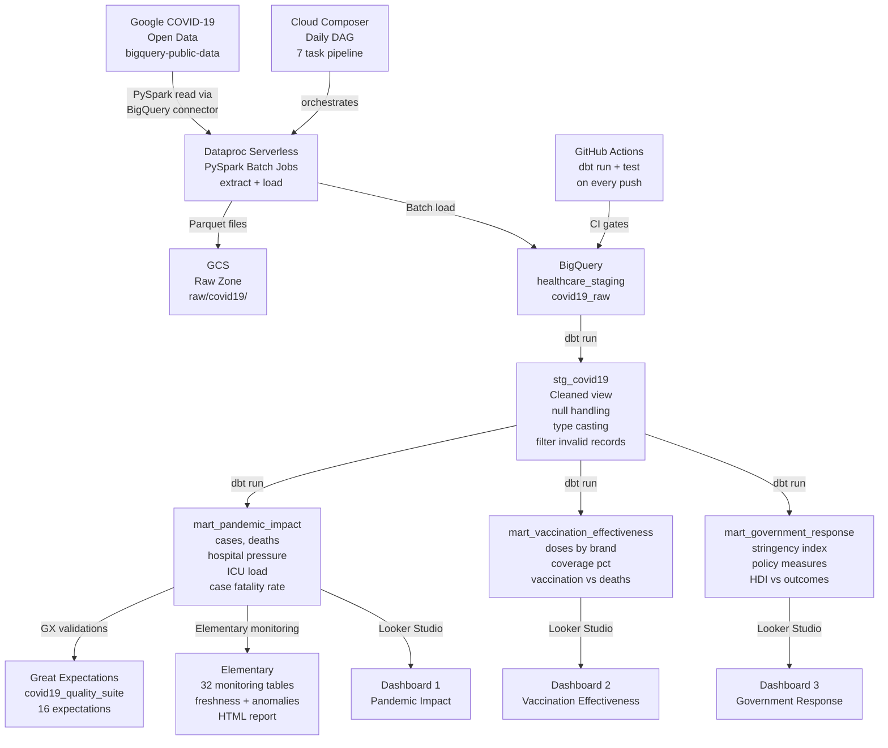

# Healthcare Data Quality & Observability Platform


A production-grade batch data engineering platform that ingests the **Google COVID-19 Open Data** dataset (~700 columns, millions of rows) via **PySpark on Dataproc Serverless**, transforms it through layered **dbt models** in **BigQuery**, validates it with **Great Expectations**, and monitors it continuously with **Elementary** — delivering three analytical dashboards in **Looker Studio** with full CI/CD through **GitHub Actions** and orchestration via **Cloud Composer**.

---

## Table of Contents

- [Architecture](#architecture)
- [Key Engineering Decisions](#key-engineering-decisions)
- [Data Engineering Concepts Implemented](#data-engineering-concepts-implemented)
- [Tech Stack](#tech-stack)
- [Project Structure](#project-structure)
- [Data Pipeline](#data-pipeline)
- [dbt Models](#dbt-models)
- [Data Quality](#data-quality)
- [Observability](#observability)
- [Orchestration](#orchestration)
- [CI/CD](#cicd)
- [Dashboards](#dashboards)
- [Quick Start](#quick-start)
- [Environment Variables](#environment-variables)
- [Roadmap](#roadmap)

---

## Architecture



---

## Key Engineering Decisions

**Why Dataproc Serverless over a managed cluster?**
Serverless eliminates cluster lifecycle management — no provisioning, no idle costs, no zone availability issues. Jobs submit directly and scale automatically. For batch workloads that run once daily, paying per-second for actual compute is significantly cheaper than keeping a cluster alive. In this project, this also meant zero cluster configuration overhead during development.

**Why PySpark for ingestion when BigQuery can query itself?**
The source is a BigQuery public dataset, so a direct `CREATE TABLE AS SELECT` would work — but that tightly couples ingestion to BigQuery SQL and bypasses the raw zone entirely. PySpark writes Parquet to GCS first, creating an immutable raw zone that can be reprocessed if downstream transformations change. This follows the medallion architecture pattern used in production data lakes.

**Why dbt views instead of tables for mart models?**
During development, views avoid storage costs and always reflect the latest transformation logic without re-materializing. In production, mart models would be materialized as tables with `+materialized: table` and incremental strategies — the switch requires one line change in `dbt_project.yml`. Views also make schema iteration faster when requirements change.

**Why two separate quality layers — dbt tests and Great Expectations?**
They solve different problems. dbt tests are schema-level assertions that run as part of the transformation pipeline — `not_null`, `unique`, `accepted_values`. Great Expectations operates at the data level — distribution checks, regex validation, statistical bounds, and row count thresholds. A column can pass a `not_null` dbt test but still contain values outside expected business ranges. Both layers are necessary for production-grade quality coverage.

**Why Elementary over just dbt test results?**
dbt test results tell you pass/fail for the current run. Elementary builds historical context — it tracks test results over time, surfaces anomalies in row counts and column distributions, monitors data freshness, and detects schema drift between runs. This is the difference between knowing something failed today and knowing something has been degrading over the past week.

**Why cap `case_fatality_rate` at 100% in dbt rather than relaxing the GX expectation?**
Values above 100% occur in small subregions where deaths were attributed from a broader area but confirmed cases were counted locally — a known reporting artifact in the raw data. Capping at the transformation layer using `LEAST()` fixes the root cause and ensures all downstream consumers receive semantically valid data. Relaxing the expectation would hide the anomaly rather than resolve it.

**Why coalesce null metrics to 0 instead of filtering null rows?**
Most countries reported COVID case data consistently but did not report hospital or vaccination data for every day. Filtering null rows would eliminate valid case and death records simply because the country did not report ICU capacity that day. Coalescing to 0 preserves the full dataset and allows aggregation functions to behave correctly, while the absence of data is semantically equivalent to zero reported.

**Why Cloud Composer for orchestration?**
Cloud Composer is managed Airflow on GCP — it integrates natively with Dataproc, BigQuery, and GCS without custom operators. The DAG in this project defines the full dependency chain: extract → load → validate → transform → test → quality check → report. The DAG is written for Composer 2.x and documented for deployment even though it runs in a cloud environment.

---

## Data Engineering Concepts Implemented

| Concept | Implementation |
|---|---|
| Medallion architecture | Raw zone (GCS Parquet) → Staging (BigQuery) → Marts (dbt views) |
| Batch processing | PySpark reads millions of rows from BigQuery, writes Parquet to GCS |
| Incremental-ready design | dbt models structured for `incremental` materialization in production |
| Null strategy | Coalesce to 0 at staging — preserves records, enables safe aggregation |
| Data correction handling | Negative values filtered at staging — countries retroactively correct over-reported counts |
| Schema-level testing | 36 dbt tests across 4 models — not_null, accepted_values, relationships |
| Statistical validation | Great Expectations validates distributions, regex, ranges, and row counts |
| Observability vs monitoring | Elementary tracks historical trends — not just current run pass/fail |
| CI/CD gating | GitHub Actions runs dbt run + dbt test on every push — broken models cannot merge |
| DAG-based orchestration | Cloud Composer DAG chains 7 tasks with retry logic and failure alerting |
| Environment separation | Pydantic settings loads config from `.env` — no hardcoded values in code |

---

## Tech Stack

| Layer | Technology | Purpose |
|---|---|---|
| Batch processing | PySpark 3.5 on Dataproc Serverless | Large-scale extraction and loading |
| Object storage | Google Cloud Storage | Raw zone — immutable Parquet files |
| Data warehouse | Google BigQuery | Staging and analytical storage |
| Transformation | dbt 1.9 + BigQuery adapter | Layered SQL modeling with tests |
| Data quality | Great Expectations 1.1 | Expectation-based statistical validation |
| Observability | Elementary 0.23 | dbt monitoring, freshness, anomaly detection |
| Orchestration | Cloud Composer 2.x (Airflow) | Daily pipeline scheduling and dependency management |
| CI/CD | GitHub Actions | Automated dbt run + test on every push |
| Visualization | Looker Studio | Three analytical dashboards |
| Config | Pydantic-settings | Type-validated environment-based configuration |
| Language | Python 3.11 | Primary development language |

---

## Project Structure

```
healthcare-data-quality-observability-platform/
│
├── .github/
│   └── workflows/
│       └── dbt_ci.yml                  # GitHub Actions — dbt run + test on push
│
├── config/
│   └── settings.py                     # Pydantic settings — env-based config
│
├── dags/
│   └── healthcare_pipeline_dag.py      # Cloud Composer DAG — 7 task pipeline
│
├── gx/                                 # Great Expectations project
│   ├── great_expectations.yml
│   └── expectations/
│       └── covid19_quality_suite.json  # 16 expectations on mart_pandemic_impact
│
├── healthcare_dbt/                     # dbt project
│   ├── models/
│   │   ├── staging/
│   │   │   ├── sources.yml             # Source: healthcare_staging.covid19_raw
│   │   │   ├── stg_covid19.sql         # Null coalescing, type casting, filtering
│   │   │   └── stg_covid19.yml         # 8 tests + column documentation
│   │   └── marts/
│   │       ├── mart_pandemic_impact.sql          # Cases, deaths, ICU, fatality rate
│   │       ├── mart_pandemic_impact.yml          # 10 tests + documentation
│   │       ├── mart_vaccination_effectiveness.sql # Doses by brand, coverage pct
│   │       ├── mart_vaccination_effectiveness.yml # 11 tests + documentation
│   │       ├── mart_government_response.sql      # Stringency, policies, HDI
│   │       └── mart_government_response.yml      # 7 tests + documentation
│   ├── packages.yml                    # elementary-data/elementary + dbt_utils
│   └── dbt_project.yml
│
├── src/
│   ├── ingestion/
│   │   ├── extract_covid_data.py       # PySpark: BigQuery public data → GCS Parquet
│   │   └── load_to_bigquery.py         # PySpark: GCS Parquet → BigQuery staging
│   └── quality/
│       ├── setup_gx.py                 # Initialize GX file context
│       ├── create_expectations.py      # Define covid19_quality_suite expectations
│       └── run_validations.py          # Execute suite against mart_pandemic_impact
│
├── .env.example                        # Template — copy to .env and fill values
├── .gitignore
├── requirements.txt
└── README.md
```

---

## Data Pipeline

### Source Dataset
- **Table:** `bigquery-public-data.covid19_open_data.covid19_open_data`
- **Columns:** 701 (cases, deaths, hospital, vaccination, government response, demographics, search trends)
- **Rows:** Millions of daily country-level records from 2020 to 2022
- **Coverage:** Global — 200+ countries and territories

### Stage 1 — Extraction (PySpark on Dataproc Serverless)

```
bigquery-public-data.covid19_open_data
        │
        │  PySpark reads via BigQuery Spark connector
        │  Submitted as serverless batch — no cluster required
        ▼
gs://healthcare-data-platform/raw/covid19/
        └── *.parquet  (columnar, partitioned output)
```

### Stage 2 — Loading (PySpark on Dataproc Serverless)

```
gs://healthcare-data-platform/raw/covid19/*.parquet
        │
        │  PySpark reads Parquet
        │  Writes via BigQuery connector with temporary GCS bucket
        ▼
covid19_raw  (healthcare_staging dataset)
```

### Stage 3 — Transformation (dbt)

```
healthcare_staging.covid19_raw
        │
        │  stg_covid19 — cleaning layer
        │  - coalesce 30+ numeric columns to 0
        │  - filter: country_code IS NOT NULL
        │  - filter: date >= 2020-01-01 AND date <= CURRENT_DATE()
        │  - filter: new_confirmed >= 0 AND new_deceased >= 0
        ▼
stg_covid19 (view)
        │
        ├──► mart_pandemic_impact            (aggregated by date + country)
        ├──► mart_vaccination_effectiveness  (aggregated by date + country)
        └──► mart_government_response        (aggregated by date + country)
```

---

## dbt Models

### Staging

**`stg_covid19`** — single clean source of truth for all mart models

Selects 25 columns from 701 available, coalesces all numeric columns to 0, and filters out data correction artifacts (negative values) and invalid dates. All three mart models reference this view via `{{ ref('stg_covid19') }}` — changing cleaning logic here propagates to all downstream models automatically.

### Marts

**`mart_pandemic_impact`**

| Column | Description |
|---|---|
| `total_new_cases` | Daily new confirmed cases aggregated by country |
| `total_new_deaths` | Daily new deaths aggregated by country |
| `total_cumulative_cases` | Running total confirmed cases |
| `total_cumulative_deaths` | Running total deaths |
| `current_icu_patients` | Current ICU occupancy |
| `current_ventilator_patients` | Current patients on ventilators |
| `current_hospitalized` | Current hospitalized patients |
| `case_fatality_rate` | `LEAST(deaths / confirmed * 100, 100)` — capped at 100% |
| `hospitalization_rate` | Hospitalized / Cumulative confirmed × 100 |
| `avg_hospital_beds_per_1000` | Average hospital capacity indicator |

**`mart_vaccination_effectiveness`**

| Column | Description |
|---|---|
| `total_new_vaccinated` | New people receiving first dose per day |
| `total_new_fully_vaccinated` | New people completing vaccination per day |
| `total_cumulative_doses` | Running total doses administered |
| `total_doses_pfizer` | Pfizer doses — brand-level tracking |
| `total_doses_moderna` | Moderna doses — brand-level tracking |
| `total_doses_janssen` | Janssen doses — brand-level tracking |
| `vaccination_coverage_pct` | Fully vaccinated / Population × 100 |
| `total_new_cases` | Same-day cases for effectiveness comparison |
| `total_new_deaths` | Same-day deaths for effectiveness comparison |

**`mart_government_response`**

| Column | Description |
|---|---|
| `avg_stringency_index` | Oxford stringency score 0–100 |
| `school_closing` | School closure policy level 0–3 |
| `workplace_closing` | Workplace closure level 0–3 |
| `stay_at_home_requirements` | Stay-at-home policy level 0–3 |
| `international_travel_controls` | Travel restriction level 0–4 |
| `cancel_public_events` | Public event cancellation level 0–2 |
| `case_fatality_rate` | Outcome metric for policy correlation |
| `avg_gdp_per_capita` | Economic context for policy analysis |
| `avg_hdi` | Human Development Index for country comparison |

### Test Coverage

```
Total: 36 tests — all passing ✅

stg_covid19                        8 tests
mart_pandemic_impact              10 tests
mart_vaccination_effectiveness    11 tests
mart_government_response           7 tests
```

---

## Data Quality

### Great Expectations Suite: `covid19_quality_suite`

Applied to `mart_pandemic_impact` after every dbt run.

| Expectation | Target | Rule |
|---|---|---|
| `ExpectTableRowCountToBeBetween` | Table | Minimum 1,000 rows |
| `ExpectColumnToExist` | 5 key columns | Must be present in schema |
| `ExpectColumnValuesToNotBeNull` | `date`, `country_code` | No nulls in key columns |
| `ExpectColumnValueLengthsToBeBetween` | `country_code` | Exactly 2 characters |
| `ExpectColumnValuesToMatchRegex` | `country_code` | Must match `^[A-Z]{2}$` |
| `ExpectColumnMinToBeBetween` | `total_new_cases` | Minimum >= 0 |
| `ExpectColumnMinToBeBetween` | `total_new_deaths` | Minimum >= 0 |
| `ExpectColumnMinToBeBetween` | `current_icu_patients` | Minimum >= 0 |
| `ExpectColumnMinToBeBetween` | `current_ventilator_patients` | Minimum >= 0 |
| `ExpectColumnValuesToBeBetween` | `case_fatality_rate` | 0–1000, `mostly=0.99` |

**Result: 16/16 passing ✅**

### Quality Decisions

**Negative case counts filtered at staging, not GX:** Negative values represent retroactive country corrections to previously over-reported numbers — a known pattern in epidemiological data. Filtering at `stg_covid19` means no downstream model ever sees negative counts. Catching this in GX after the fact would report a failure without fixing the data.

**`case_fatality_rate` capped at 100% in dbt:** Values above 100% occur in small subregions where deaths are attributed from a broader administrative area but confirmed cases are counted locally. `LEAST(value, 100)` at the transformation layer produces semantically valid output for all consumers. The GX expectation then uses `mostly=0.99` to allow rare statistical outliers that survive aggregation.

**`ExpectColumnMinToBeBetween` instead of `ExpectColumnValuesToBeBetween` for counts:** Count columns have no defined upper bound — case counts could be millions during peak waves. Checking the column minimum >= 0 is sufficient to ensure no negative values exist without imposing an arbitrary upper limit that would require constant maintenance.

---

## Observability

Elementary runs alongside dbt and automatically persists metadata from every run into BigQuery. This provides historical context that dbt test results alone cannot — not just whether something failed today, but whether data volume has been declining for a week.

### Elementary Datasets

```
healthcare_staging_elementary/
├── dbt_invocations          — every dbt run logged with timing and status
├── dbt_models               — model-level metadata and row counts
├── dbt_tests                — test results with historical pass/fail tracking
├── dbt_run_results          — execution time per model per run
├── elementary_test_results  — enriched test results with anomaly scores
├── model_run_results        — per-model performance over time
├── data_monitoring_metrics  — statistical metrics per column
├── metrics_anomaly_score    — anomaly detection scores
└── ... (32 monitoring tables total)
```

### Generate Report

```bash
cd healthcare_dbt
edr report --profiles-dir ~/.dbt
# opens elementary_report.html in browser
```

The HTML report shows test result history, model execution trends, schema change log, and data freshness indicators — shareable with stakeholders without BigQuery access.

---

## Orchestration

### Cloud Composer DAG: `healthcare_data_pipeline`

> **Deployment note:** This DAG targets Cloud Composer 2.x with Airflow 2.x. `apache-airflow-providers-google` is pre-installed in Composer environments. Local IDE import warnings are expected — all imports resolve inside the Composer runtime. To test locally, use [Astro CLI](https://docs.astronomer.io/astro/cli/install-cli).

**Schedule:** `0 0 * * *` — daily at midnight UTC
**Retries:** 2 attempts per task, 5-minute delay
**Catchup:** disabled

```
extract_covid_data
    PySpark Serverless: BigQuery public data → GCS Parquet
        ↓
load_to_bigquery
    PySpark Serverless: GCS Parquet → BigQuery staging
        ↓
validate_raw_data
    BigQueryCheckOperator: confirms yesterday's data arrived
        ↓
dbt_run
    BashOperator: dbt run --target dev
        ↓
dbt_test
    BashOperator: dbt test --target dev
        ↓
gx_validation
    BashOperator: python src/quality/run_validations.py
        ↓
elementary_report
    BashOperator: edr report
```

Any task failure stops the pipeline at that point — downstream tasks are skipped, retries execute after 5 minutes, and email alerts fire on final failure.

---

## CI/CD

### GitHub Actions: `dbt CI Pipeline`

Triggers on push to `main` or `develop` and on pull requests to `main`.

```
push / pull_request
        ↓
Set up Python 3.11
        ↓
Install dbt-bigquery==1.9.0
        ↓
Write GCP credentials from secret → /tmp/gcp-key.json
        ↓
Generate profiles.yml dynamically from env vars
        ↓
dbt deps
        ↓
dbt run --target dev
        ↓
dbt test --target dev
        ↓
Log success or failure with run URL
```

**Required GitHub Secret:**

| Secret | Description |
|---|---|
| `GCP_SERVICE_ACCOUNT_KEY` | Full JSON content of GCP service account key |

Credentials are written to a temp file inside the runner — never logged, never persisted after the run completes.

---

## Dashboards

Three Looker Studio dashboards connect directly to BigQuery mart tables. Each page includes a country filter and date range control.

### Dashboard 1 — Pandemic Impact
- World geo chart — cumulative cases by country
- Time series — daily new cases and deaths
- Bar chart — case fatality rate by country (top 20)
- Scorecards — current ICU patients, ventilator patients, hospitalized

### Dashboard 2 — Vaccination Effectiveness
- Scorecard — vaccination coverage percentage
- Pie chart — doses by brand (Pfizer / Moderna / Janssen)
- Time series — new vaccinations vs new deaths over time
- Cumulative vaccination progress by country

### Dashboard 3 — Government Response
- Time series — stringency index vs new case count
- Scorecards — stay-at-home level, school closing level, travel controls level
- Scatter chart — HDI vs case fatality rate by country
- Table — GDP per capita vs vaccination coverage

---

## Quick Start

### Prerequisites

- Python 3.11+
- GCP project with billing enabled
- APIs enabled: BigQuery, Cloud Storage, Dataproc
- Service account with required permissions

### Required GCP Permissions

```
roles/bigquery.dataViewer      — read BigQuery datasets
roles/bigquery.jobUser         — run queries and jobs
roles/storage.objectAdmin      — read/write GCS bucket
roles/dataproc.worker          — submit Dataproc Serverless batches
```

### Setup

```bash
# clone repository
git clone https://github.com/yourusername/healthcare-data-quality-observability-platform
cd healthcare-data-quality-observability-platform

# create virtual environment
python -m venv virtual-env
source virtual-env/bin/activate        # Linux/Mac
virtual-env\Scripts\activate           # Windows

# install dependencies
pip install -r requirements.txt

# configure environment
cp .env.example .env
# fill in GCP values in .env

# set credentials
export GOOGLE_APPLICATION_CREDENTIALS="/path/to/sa-key.json"
# Windows: setx GOOGLE_APPLICATION_CREDENTIALS "C:\path\to\sa-key.json"

# create GCS bucket
gsutil mb -l us-central1 gs://your-bucket-name/

# create BigQuery dataset
bq mk --dataset your-project:healthcare_staging
```

### Run the Pipeline

```bash
# upload PySpark scripts to GCS
gsutil cp src/ingestion/extract_covid_data.py gs://your-bucket/scripts/
gsutil cp src/ingestion/load_to_bigquery.py gs://your-bucket/scripts/

# submit extraction job
gcloud dataproc batches submit pyspark gs://your-bucket/scripts/extract_covid_data.py \
  --region=us-central1 --project=your-project \
  --deps-bucket=gs://your-bucket \
  -- your-project your-bucket

# submit loading job
gcloud dataproc batches submit pyspark gs://your-bucket/scripts/load_to_bigquery.py \
  --region=us-central1 --project=your-project \
  --deps-bucket=gs://your-bucket \
  -- your-project your-bucket

# run dbt
cd healthcare_dbt
dbt deps
dbt run
dbt test

# run GX validations
cd ..
python src/quality/run_validations.py

# generate Elementary report
cd healthcare_dbt
edr report --profiles-dir ~/.dbt
```

---

## Environment Variables

| Variable | Required | Default | Description |
|---|---|---|---|
| `GCP_PROJECT_ID` | Yes | — | GCP project ID |
| `GCS_BUCKET_NAME` | Yes | — | GCS bucket for raw Parquet files and scripts |
| `GOOGLE_APPLICATION_CREDENTIALS` | Yes | — | Path to service account JSON key |
| `BQ_DATASET` | No | `healthcare_staging` | BigQuery dataset name |
| `BQ_TABLE` | No | `covid19_open_data` | Source table name |
| `BQ_PUBLIC_PROJECT` | No | `bigquery-public-data` | Public dataset project |

Add the following profiles to `~/.dbt/profiles.yml`:

```yaml
healthcare_dbt:
  outputs:
    dev:
      type: bigquery
      method: service-account
      project: your-project-id
      dataset: healthcare_staging
      keyfile: /path/to/sa-key.json
      location: US
      threads: 4
      job_execution_timeout_seconds: 300
      job_retries: 1
      priority: interactive
  target: dev

elementary:
  outputs:
    default:
      type: bigquery
      method: service-account
      project: your-project-id
      dataset: healthcare_staging_elementary
      keyfile: /path/to/sa-key.json
      location: US
      threads: 1
  target: default
```

---

## Roadmap

| Status | Feature |
|---|---|
| ✅ Done | PySpark batch extraction from BigQuery public dataset |
| ✅ Done | Dataproc Serverless job submission — no cluster management |
| ✅ Done | GCS raw zone — immutable Parquet files |
| ✅ Done | BigQuery staging table load via PySpark |
| ✅ Done | dbt staging model — null handling, filtering, type casting |
| ✅ Done | dbt mart models — pandemic impact, vaccination, government response |
| ✅ Done | 36 dbt tests — all passing |
| ✅ Done | Great Expectations suite — 16 expectations, all passing |
| ✅ Done | Elementary observability — 32 monitoring tables, HTML report |
| ✅ Done | Looker Studio dashboards — 3 pages with filters |
| ✅ Done | GitHub Actions CI — dbt run + test on every push |
| ✅ Done | Cloud Composer DAG — 7 task pipeline with retry logic |
| ✅ Done | Pydantic settings — environment-based configuration |
| Next | Astro CLI local DAG testing |
| Next | GX validations for vaccination and government response marts |
| Next | Elementary anomaly detection tests in dbt yml files |
| Next | dbt incremental models for production materialization |
| Next | Cloud Run hosting for Elementary HTML report |
| Future | dbt snapshots for slowly changing dimension tracking |
| Future | Data contracts between ingestion and transformation layers |
| Future | Streaming ingestion with Pub/Sub + Dataflow for real-time layer |

---

*Built with Python and Google Cloud Platform — Batch data quality and observability for public health analytics*
